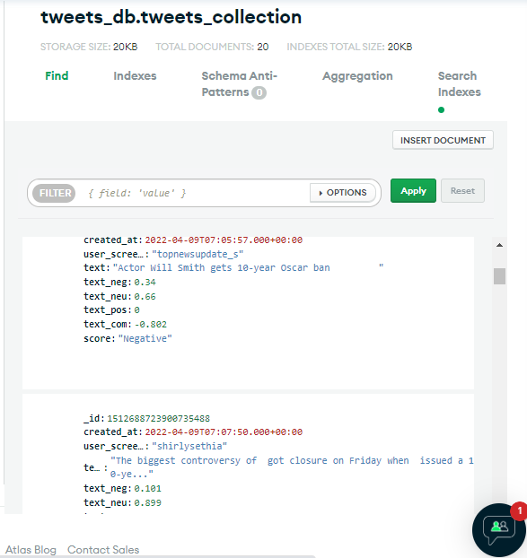

# Twitter-sentiment-analysis
A twitter sentiment analysis with NLP

Twitter is one of the biggest platforms where massive instant messages (i.e. tweets) are published every day. Users tend to express their real feelings freely in Twitter, which makes it an ideal source for capturing the opinions towards various interesting topics, such as brands, products or celebrities, etc. Naturally, people may anticipate an approach to receiving the common sentiment tendency towards these topics directly rather than through reading the huge amount of tweets about them.

In this project, you can gain an overall impression of Natural Language Processing (NLP). To be able to find out what an audience thinks about a topic, we need to get deeper insights into the linguistic features of their utterances. As an NLP Specialist, our task will be to analyze Twitter users comments about a particular topic/product. In order to carry out this task, we will employ different NLP methods. These methods will enable us to acquire a deeper understanding of users feeling and opinions.

The task we will be carrying out:
- Creating our own dataset from twitter users comments using tweepy library.
- Cleaning tweets by removing all duplicate tweets, ponctuation, numbers, stop-words, hashtags, links, @mentions and spaces nevertheless emojis will be kept as they emphasize the tweet polarity. 
- Deciding whether people like or dislike a certain product/subject by labeling each tweet with a sentiment score between -1 and 1.
- Saving the dataset locally to a csv file and on the cloud on a MongoDb database collection.
- Summarizing our results by aggregating them by polarity in order to be displayed them as a pie chart.

## Techniques Employed
In order to get a deeper understanding of people’s opinion about a topic, you will employ various NLP techniques. Here is a short list about what you will do and what techniques you will use.

- Enquiring about the sentiment value of the reviews with the dictionary-based sentiment analysis tools, which are part of Vader, a natural language processing toolkit, used in Python.
- Visualizing our findings with matploitlib and mongodb chart feature.

## Dataset
<picture>
  <source media="(prefers-color-scheme: dark)" srcset="Assets/csv.png">
  <source media="(prefers-color-scheme: light)" srcset="Assets/csv.png">
  
</picture>

<picture>
  <source media="(prefers-color-scheme: dark)" srcset="Assets/collect.png">
  <source media="(prefers-color-scheme: light)" srcset="Assets/collect.png">
  
</picture>

## Visualization

<picture>
  <source media="(prefers-color-scheme: dark)" srcset="Assets/matplotlib_chart.png">
  <source media="(prefers-color-scheme: light)" srcset="Assets/matplotlib_chart.png">
  
</picture>

<picture>
  <source media="(prefers-color-scheme: dark)" srcset="Assets/mongodb_chart.png">
  <source media="(prefers-color-scheme: light)" srcset="Assets/mongodb_chart.png">
  
</picture>
